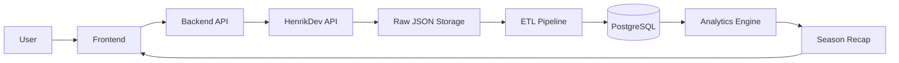

# System Architecture

## Overview

Valorant Season Recap is a data engineering and analytics application that transforms raw Valorant match data into personalized seasonal insights.

The system consists of five major components:

1. Data Acquisition
2. ETL Pipeline
3. Analytics Database
4. Analytics Engine
5. User Application

Each component has a single responsibility and communicates through well-defined interfaces.

---

# High-Level Architecture

---

# System Components

## User Application

Responsible for:

- Player search
- Viewing season recaps
- Displaying visualizations
- User interaction

---

## Backend

Responsible for:

- Processing user requests
- Calling the ETL pipeline
- Reading analytics from PostgreSQL
- Returning recap data

---

## Data Acquisition

Responsible for:

- Connecting to the HenrikDev API
- Downloading player data
- Managing API authentication
- Handling API rate limits

---

## ETL Pipeline

Responsible for:

- Parsing API responses
- Normalizing nested JSON
- Cleaning data
- Loading data into PostgreSQL

---

## Analytics Database

Stores:

- Raw match information
- Player statistics
- Match events
- Aggregate statistics

---

## Analytics Engine

Responsible for:

- Season summaries
- Agent performance
- Map performance
- Weapon statistics
- Highlight metrics

---

# Architectural Principles

The project follows several engineering principles:

- Separation of concerns
- Modular design
- Reproducible data processing
- Scalable analytics
- Documentation-first development