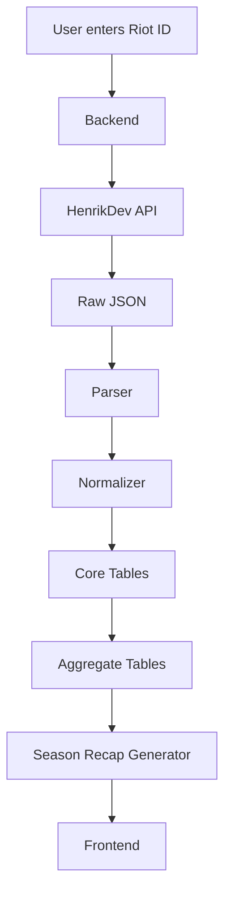

# Data Flow

## Overview

This document describes how data moves through the Valorant Season Recap system.

The pipeline follows a traditional Extract → Transform → Load (ETL) workflow before generating analytical summaries.

---

# End-to-End Flow

---

# Pipeline Stages

## 1. Extract

Input

- Riot ID

Output

- Raw JSON responses

Responsibilities

- API communication
- Authentication
- Request throttling
- Retry handling

---

## 2. Raw Data Storage

Purpose

Store original API responses before transformation.

Benefits

- Reproducibility
- Easier debugging
- Parser improvements
- Historical snapshots

---

## 3. Parse

Purpose

Convert nested API responses into structured Python objects.

Responsibilities

- Flatten JSON
- Extract entities
- Standardize field names

---

## 4. Normalize

Purpose

Prepare parsed objects for database insertion.

Responsibilities

- Deduplicate entities
- Group records
- Validate relationships

---

## 5. Load

Purpose

Insert normalized data into PostgreSQL.

Responsibilities

- Bulk insertion
- Conflict handling
- Referential integrity

---

## 6. Aggregate

Purpose

Generate analytics tables optimized for reporting.

Examples

- Season statistics
- Agent summaries
- Map summaries
- Weapon summaries
- Highlight metrics

---

## 7. Presentation

Purpose

Display recap statistics to the user.

Future implementation

- Interactive dashboard
- Spotify Wrapped style recap